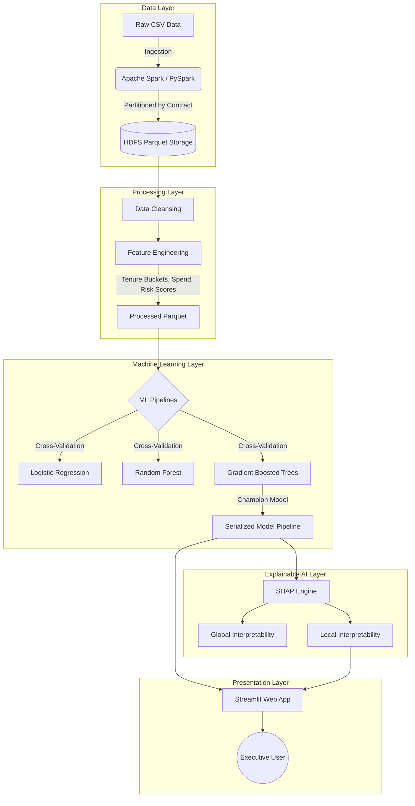

# 📚 Comprehensive Study Guide: Explainable Customer Churn Prediction

This guide provides an in-depth, microscopic look into the architecture, services, and technical decisions that power the Customer Churn Prediction and Explainable AI (XAI) project. Use this document to prepare for presentations, defenses, and technical interviews.

---

## 🏗️ 1. End-to-End System Architecture

The project follows a standard Big Data pipeline architecture.

---

## 🛠️ 2. Services Used: How They Work & Why We Chose Them

### 1. Apache Spark (PySpark) & Parquet
**How it is used:** Spark is used as the foundational engine for ingesting the raw CSV dataset, running quality audits, handling missing values, calculating engineered features, and saving the output into an HDFS-simulated directory as partitioned Parquet files.

**How it actually works (Under the Hood):**
- **Spark:** Unlike traditional databases that read/write from disk continuously, Spark uses **Resilient Distributed Datasets (RDDs)** and DataFrames to process data in memory (RAM) across a cluster of computers. It uses the **Catalyst Optimizer** to automatically find the most efficient query execution plan before actually running the code (lazy evaluation).
- **Parquet:** A columnar storage file format. Instead of storing data row-by-row like a CSV, it stores data column-by-column. This allows for massive compression (using Snappy) and "predicate pushdown" (skipping irrelevant columns entirely when reading).

> [!TIP] 
> **Direct Comparison: PySpark vs. Pandas (CSV)**
> - *Pandas* loads the entire dataset into the RAM of a single machine. If the dataset exceeds the RAM, the script crashes. 
> - *PySpark* partitions the data and distributes it across multiple nodes (or multiple CPU cores locally), making it infinitely scalable. 
> - *Why it's better for this project:* While the Telco dataset is relatively small (7,000 rows), using PySpark and Parquet simulates a true enterprise Big Data architecture, proving the pipeline can scale to 700 million rows without code changes.

### 2. Spark MLlib & Scikit-Learn
**How it is used:** To build predictive pipelines (StringIndexer, OneHotEncoder, VectorAssembler, MinMaxScaler) and train classification algorithms (Logistic Regression, Random Forest, Gradient Boosted Trees). GBT was selected as the champion model with an ~84.6% ROC-AUC.

**How it actually works:**
- **Gradient Boosted Trees (GBT):** An ensemble machine learning technique. It builds multiple decision trees sequentially. Unlike Random Forest (which builds trees independently and averages them), GBT builds tree #2 specifically to correct the mathematical errors (residuals) made by tree #1. This results in highly accurate predictions.

> [!TIP] 
> **Direct Comparison: Gradient Boosted Trees vs. Logistic Regression**
> - *Logistic Regression* is a linear model. It assumes a straight-line relationship between features (like Monthly Charges) and Churn.
> - *GBT* is a non-linear ensemble model. It can capture complex patterns (e.g., "High monthly charges only lead to churn IF the customer has a month-to-month contract AND no tech support").
> - *Why it's better for this project:* Telecommunications behavior is complex. GBT captures these deep, non-linear interactions, leading to significantly higher accuracy and precision.

### 3. SHAP (SHapley Additive exPlanations)
**How it is used:** To completely demystify the "black box" GBT model. It is used globally to generate beeswarm plots (identifying overarching churn drivers) and locally to generate waterfall plots for live, single-customer inference.

**How it actually works:**
SHAP is grounded in **Cooperative Game Theory**. Imagine the prediction model is a "game," the features (Tenure, Contract, Charges) are the "players," and the prediction output (Churn Probability) is the "payout." 
SHAP calculates the exact marginal contribution of each player by testing every possible combination of players being present or absent. It guarantees that the sum of all feature impacts equals the final prediction score.

> [!IMPORTANT] 
> **Direct Comparison: SHAP vs. Traditional Feature Importance (Gini)**
> - *Gini Importance* (built into Random Forest/GBT) only tells you *which* features were used the most to split trees. It does not tell you the direction (does it increase or decrease churn?) or work for individual predictions.
> - *SHAP* provides directional impact (e.g., Month-to-Month increases risk, Two-Year decreases risk) and works down to the microscopic level of a single individual customer.
> - *Why it's better for this project:* Business stakeholders need actionable insights, not just mathematical rankings. SHAP explicitly tells agents *why* John Doe is at a 75% risk today.

### 4. Streamlit (Frontend Dashboard)
**How it is used:** To host the live web application that allows executives to view high-level metrics, and retention agents to input live customer data, receive a probability score via the interactive Gauge (speedometer), and view the SHAP waterfall.

**How it actually works:**
Streamlit operates on a **reactive execution model**. Every time a user changes a widget (like a dropdown or slider), Streamlit re-runs the entire Python script from top to bottom. It heavily relies on caching (`@st.cache_data` and `@st.cache_resource`) to ensure machine learning models and heavy datasets are loaded only once into RAM, keeping the UI instantly responsive.

> [!TIP] 
> **Direct Comparison: Streamlit vs. Flask / Django**
> - *Flask/Django* require writing separate backend routing (Python) and frontend code (HTML/CSS/JS). Building a dashboard takes weeks and requires full-stack knowledge.
> - *Streamlit* allows data scientists to build complex, interactive UIs entirely in pure Python in a matter of hours.
> - *Why it's better for this project:* It drastically accelerates prototyping. We were able to inject custom CSS to build a premium, dark-mode Emerald/Rose aesthetic without needing a dedicated frontend engineering team.

---

## 🔬 3. Minute Details & Data Science Workflow

To ensure you can speak to the microscopic details of the project, here is the exact data flow:

1. **Handling Missing Data:** The raw data contained blank strings (`" "`) in the `TotalCharges` column. Instead of dropping these rows (which loses valuable data), they were coerced to `NaN` and imputed with the statistical **median** of the column to prevent skewing the distribution.
2. **Feature Engineering Strategy:** Raw data is rarely enough. The project engineered advanced metrics:
   - **`avg_monthly_spend`**: Calculated as `TotalCharges / (tenure + 1)`. Uncovers true spending habits.
   - **`contract_risk_score`**: Explicitly weights contracts (Month-to-month = 3, One Year = 2, Two Year = 1) to force the ML model to recognize contract volatility.
   - **`support_usage_indicator`**: A binary flag (1/0) indicating if the user utilizes TechSupport, OnlineSecurity, or OnlineBackup, recognizing that integrated customers churn less.
3. **Cross-Validation:** The model wasn't just trained once. It utilized **3-Fold Stratified Cross-Validation**. The dataset was split into 3 chunks, ensuring the ratio of churners to non-churners remained perfectly balanced in each chunk, preventing the model from becoming biased toward the majority class (Retained).
4. **Probability Calibration:** The final output of the live dashboard isn't just a 1 or 0; it utilizes `.predict_proba()` to output a strict percentage (e.g., 68.4% churn risk), which is then mapped dynamically to the Emerald (Safe) and Rose (Risk) UI gauge.
